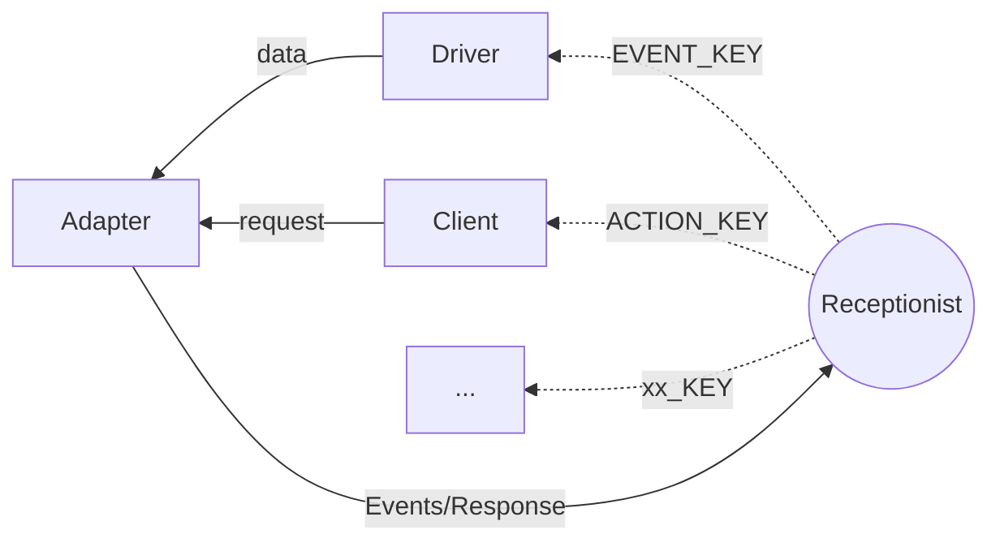

<div align="center">

# Felis

_基于Actor模式的Python机器人框架_

</div>

<p align="center">
  <a href="https://raw.githubusercontent.com/iori2333/felis/master/LICENSE">
    
  </a>
  
  <a href="https://onebot.dev/">
    
  </a>
</p>

## 快速开始

1. 为bot提供配置
    ```bash
    # neko.json
    {
        "name": "Neko",
        "driver": {
            "connect_url": "ws://url-to-server"
        }
    }
    ```
2. 运行项目
    ```python
    async def main():
        neko = Neko.from_file("neko.json")
        await neko.start()

    if __name__ == "__main__":
        asyncio.run(main())
    ```

## 使用命令

1. 通过继承`Command[T]`或`MessageCommand`新建自定义命令。新建的命令会自动通过`Commands`注册。
    ```python
    @Commands.register(name="cmd", description="xxxx")
    class MyCommand(MessageCommand):
        @override
        async def handle_message(self, event: MessageEvent, message: Message) -> None:
            self.send_back(event, message)
    ```
2. 配置`client.commands`。
    ```bash
    # neko.json
    {
        ...
        client: {
            commands: ["cmd", ...]
        }
    }
    ```

## 扩展

`Neko`类提供了`customized_setup`作为扩展点，可以通过继承的方式进行扩展。

```python
class MyEventHandler:
    @staticmethod
    def apply() -> Behavior[ClientMessage]:
        def on_message(_, message: ClientMessage) -> Behavior[ClientMessage]:
            print(message)
            return Behavior[ClientMessage].same

        def setup(context: ActorContext[ClientMessage]) -> Behavior[ClientMessage]:
            context.system.receptionist.tell(
                ReceptionistRequest.register(EVENT_KEY, context.self)
            )
            return Behaviors.receive_message(on_message)

        return Behaviors.setup(setup)

class Felis(Neko):
    @override
    def customized_setup(self, context: ActorContext[NekoMessage]) -> None:
        context.spawn(MyEventHandler.apply(), "event_handler")
```

在上例中，我们创建了一个自定义的Actor: `MyEventHandler`。它通过`EVENT_KEY`订阅了从服务器推送的事件信息并打印出来；
通过继承Neko类，我们得以在`customized_setup`中生成`MyEventHandler`。

## 结构



Felis结构主要分为`Driver`，`Adapter`，`Client`三部分：
+ `Driver`：用于与后端交互，包括接收事件和动作响应、发送动作请求。
+ `Client`：用于处理事件，如使用`Command`。
+ `Adapter`：`Driver`和`Client`的中间件，用于转换并广播事件。用户自定义的Actor可以通过订阅`EVENT_KEY`和`ACTION_KEY`获取事件和动作信息。
